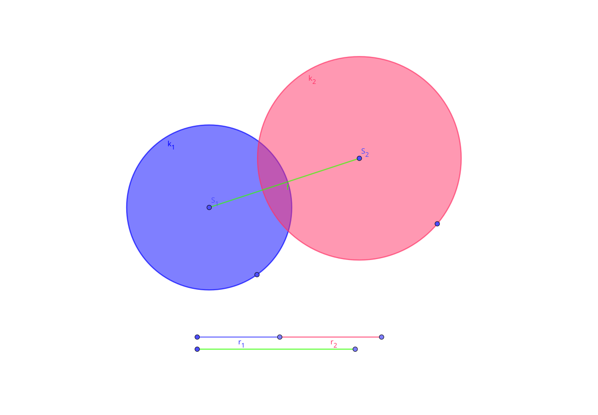
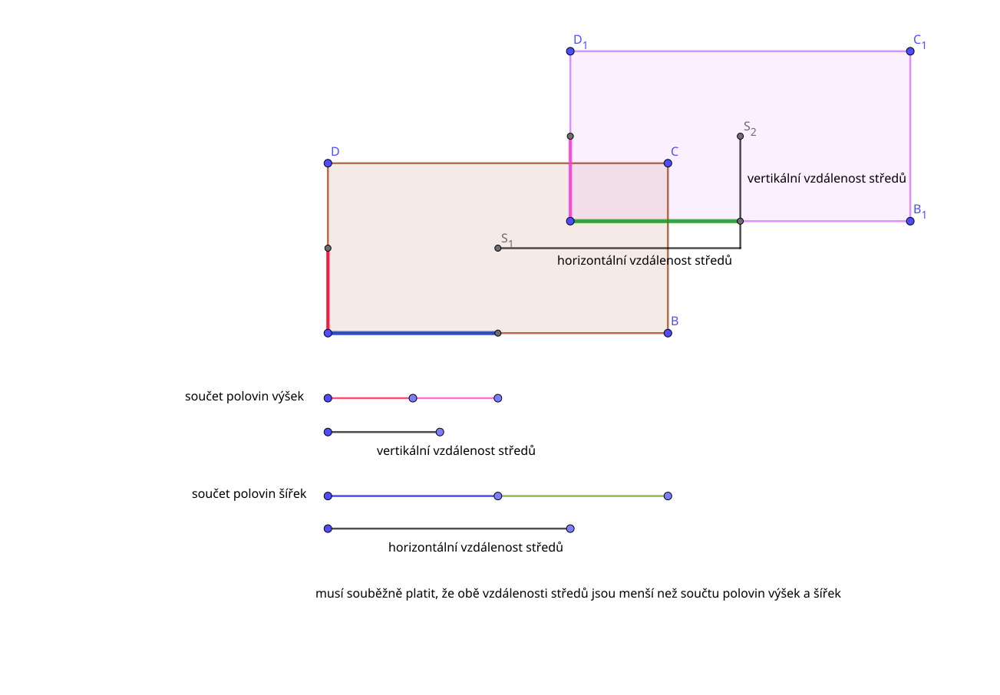

# Detekce kolizí základních 2D objektů

Pomocný text: [Detekce kolizí základních 2D objektů](/informatika/ulohy/texty/Kolize%20z%C3%A1kladn%C3%ADch%202D%20objekt%C5%AF.pdf)

* k dispozici máme 2 druhy objektů:
    * kruh (Circle)
        * vlastnosti: střed (x, y), poloměr r
    * obdélník (Quad)
        * vlastnosti: levý horní roh (x, y), šířka w, výška h
        * neřešíme úhly, prostě bereme jako obdelník i kdyby to mohl být jakýkoliv čtyřúhelník
* knihovna a projekt naklonovaný z [GitHubu](https://github.com/JindrichDvorak/BasicGraphicsEngine-Project)
* cíle:
    * implementovat metodu pro detekci kolize mezi dvěma kruhy
    * implementovat metodu pro detekci kolize mezi dvěma obdélníky
    * implementovat metodu pro detekci kolize mezi kruhem a obdelníkem

## Kolize kruhu a kruhu

```csharp
    public bool CircleCircle(Circle c1, Circle c2)
    {
        var stred1 = c1.GetPosition2D();
        var stred2 = c2.GetPosition2D();

        var vzdalenostStredu = (stred1 - stred2).Length();
        var soucetR = c1.GetRadius() + c2.GetRadius();

        return vzdalenostStredu <= soucetR;
    }
```



Interaktivní demostrace: https://www.geogebra.org/m/zpwshfvj

Na této ukázce je využita vlastnost, že pokud se dva kruhy dotýkají či protínají, tak vzdálenost mezi jejich středy je
menší nebo rovna součtu jejich poloměrů.

## Kolize obdelníku a obdélníku

```csharp
    public bool QuadQuad(Quad q1, Quad q2)
    {
        var stred1 = q1.GetPosition2D();
        var stred2 = q2.GetPosition2D();

        var stredVzdalenostX = Math.Abs(stred1.X - stred2.X);
        var stredVzdalenostY = Math.Abs(stred1.Y - stred2.Y);

        var soucetPolovinSirek = q1.GetWidth() / 2 + q2.GetWidth() / 2;
        var soucetPolovinVysek = q1.GetHeight() / 2 + q2.GetHeight() / 2;

        return stredVzdalenostX <= soucetPolovinSirek && stredVzdalenostY <= soucetPolovinVysek;
    }
```

Na této ukázce je využita vlastnost, že pokud se dva obdélníky dotýkají či protínají, tak vzdálenost mezi jejich středy
v ose X je menší nebo rovna součtu polovin jejich šířek a vzdálenost mezi jejich středy v ose Y je menší nebo rovna
součtu polovin jejich výšek.

Dá se řešit i jednodušeji pomocí porovnání pozic rohů.



Interaktivní demonstrace: https://www.geogebra.org/m/r7qyyxpe

## Kolize obdelníku a kruhu

Nejtěžší z těchto tří. Nebude nejspíš v maturitě. Zapomněl jsem to sem dát :(. Tak si na to přiďte sami :-)
